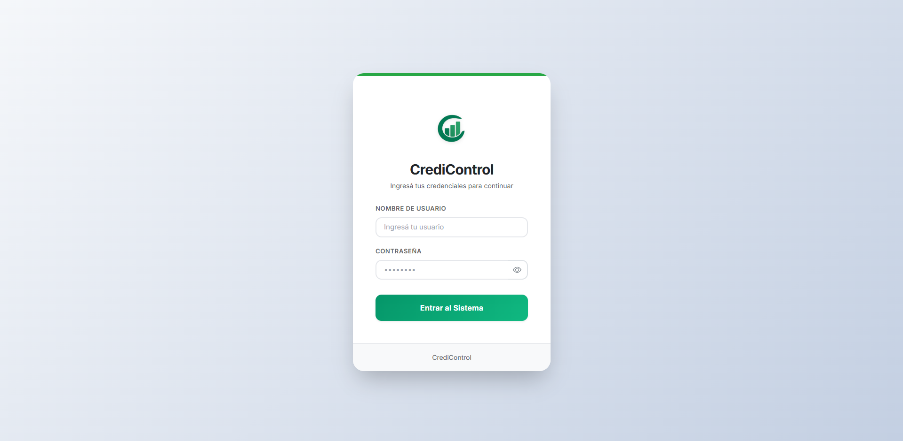
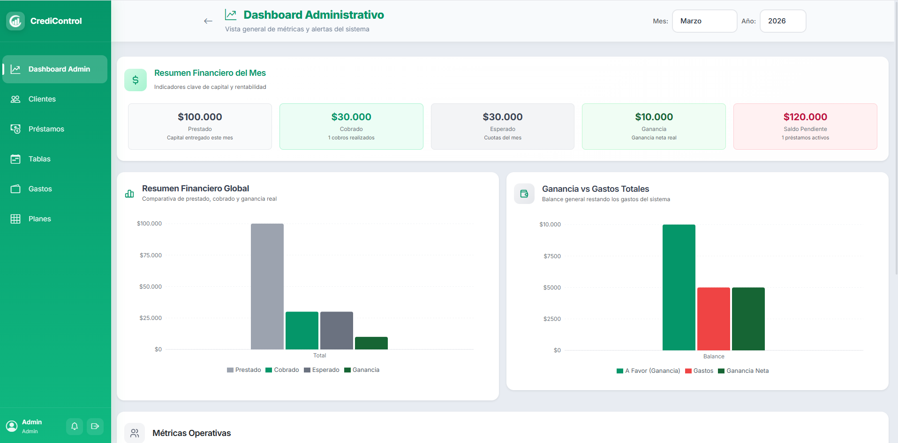
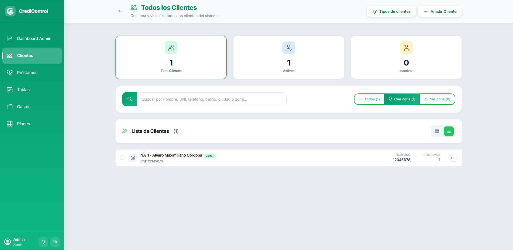
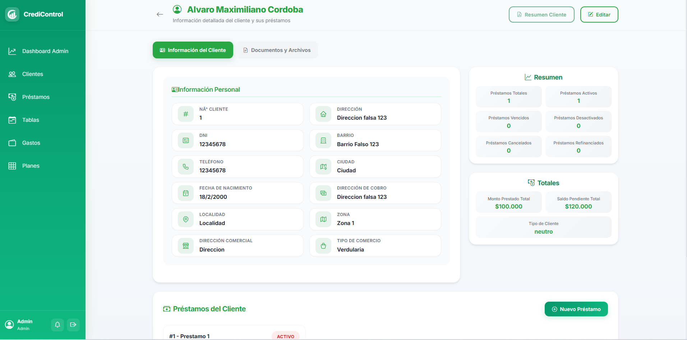

# CrediControl 💳

> Sistema completo de gestión de créditos y cobranzas — Monorepo (Frontend + Backend)

[](https://react.dev/)
[](https://nodejs.org/)
[](https://www.mongodb.com/)
[](https://expressjs.com/)

---

## ¿Qué es CrediControl?

**CrediControl** es una aplicación web de gestión de créditos y cobranzas, diseñada para pequeñas financieras y prestamistas. Permite administrar clientes, préstamos, cobradores, zonas geográficas, tablas de cobro semanales y generar reportes en PDF — todo desde una interfaz moderna y responsiva.

---

## 🏗️ Arquitectura del Proyecto

```
credicontrol/
├── frontend/          # React 19 + Vite (SPA)
└── backend/           # Node.js + Express + MongoDB (API REST)
```

El proyecto sigue una separación estricta de responsabilidades:
- El **frontend** gestiona la experiencia de usuario y no contiene lógica de negocio crítica.
- El **backend** es la autoridad de todas las reglas de negocio, validaciones y seguridad.

---

## ✨ Funcionalidades Principales

| Módulo | Descripción |
|--------|-------------|
| 🔐 **Autenticación** | JWT con Access Token + Refresh Token (cookie HttpOnly), roles Admin y Cobrador |
| 👥 **Clientes** | CRUD completo con validaciones (DNI, teléfono, dirección), scoring automático de clientes |
| 💰 **Préstamos** | Creación con planes configurables (semanal/quincenal/mensual), seguimiento de cuotas, estados (activo/cancelado/vencido/refinanciado) |
| 🗺️ **Zonas** | Gestión geográfica, asignación de cobradores, métricas por zona |
| 📋 **Tablas de cobro** | Organización semanal de cobros por cobrador, registro de pagos, exportación PDF |
| 📊 **Reportes** | Generación de PDF (comprobantes, resúmenes, tablas de amortización, registros de cobros) |
| 🔔 **Notificaciones** | Alertas automáticas para préstamos por vencer, cron de actualización nocturno |
| 📈 **Dashboard** | Métricas consolidadas para Admin, métricas de zona para Cobrador |

---

## 🛠️ Stack Tecnológico

### Frontend
- **React 19** + **Vite** — Build rápido con HMR
- **React Bootstrap 5** — UI components estilizados
- **React Router DOM 7** — Navegación SPA
- **Axios** — HTTP client con interceptores JWT automáticos
- **jsPDF + @react-pdf/renderer** — Generación de PDFs en cliente
- **SweetAlert2** — Notificaciones y confirmaciones

### Backend
- **Node.js 18+** + **Express 4** — API REST
- **MongoDB + Mongoose** — Base de datos NoSQL
- **JWT** (access + refresh tokens) — Autenticación segura
- **node-cron** — Actualización automática de estados de préstamos a medianoche
- **Cloudinary** — Almacenamiento de documentos de clientes
- **Render** — Plataforma de despliegue del backend

---

## 📸 Capturas de Pantalla

| Login | Dashboard Administrativo |
|-------|--------------------------|
|  |  |

| Gestión de Clientes | Detalle de Cliente |
|---------------------|--------------------|
|  |  |

---

## 🚀 Inicio Rápido

### Prerrequisitos
- Node.js 18+
- MongoDB Atlas (o local)
- Cuenta de Cloudinary (opcional, para documentos)

### 1. Clonar el repositorio

```bash
git clone https://github.com/cordobaalvaro/credicontrol.git
cd credicontrol
```

### 2. Configurar y levantar el Backend

```bash
cd backend
npm install
cp .env.example .env   # Completar las variables
npm run dev
```

### 3. Configurar y levantar el Frontend

```bash
cd frontend
npm install
cp .env.example .env   # Completar VITE_API_BASE_URL
npm run dev            # Web en localhost:5173
```

---

## 🌐 Despliegue en Producción

El sistema está configurado y optimizado para entornos de nube:

- **Frontend (Vercel):** Configuración lista para despliegue continuo (CI/CD) con manejo de rutas SPA (`vercel.json`).
- **Backend (Render):** Soporte nativo para Node.js, variables de entorno seguras y persistencia MongoDB Atlas.

---

## 📁 Documentación Detallada

- 📖 **[frontend/README.md](./frontend/README.md)** — Instalación, estructura, rutas, deploy en Vercel
- 📖 **[backend/README.md](./backend/README.md)** — Endpoints, variables de entorno, estructura MVC, deploy en Render

---

## 👤 Autor

**Álvaro Córdoba**
- GitHub: [@cordobaalvaro](https://github.com/cordobaalvaro)
- LinkedIn: [linkedin.com/in/cordobaalvaro](https://www.linkedin.com/in/alvaro-maximiliano-cordoba-90335236b/)

---

## 📄 Licencia

Este proyecto está bajo licencia **MIT**. Ver [LICENSE](./LICENSE) para más detalles.

---

<p align="center">Desarrollado con ❤️ — CrediControl © 2025</p>
